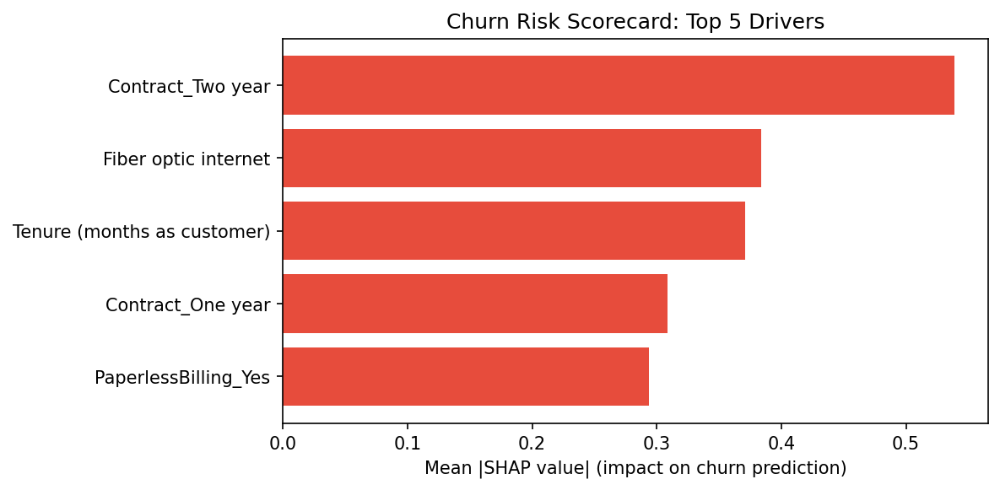

# Predict Customer Churn

Predicting telecom customer churn using machine learning to help retention teams intervene before customers leave.

## Problem
Telecom companies lose significant revenue to churn. This project identifies at-risk customers from behavioral and account data so retention teams can act proactively.

## Data
IBM Telco Customer Churn dataset: 7,043 customers, 21 features including contract type, tenure, monthly charges, and service subscriptions. ~26% churn rate (class imbalance handled with SMOTENC).

## Approach
1. **EDA**: Identified key churn drivers — contract type, tenure, and monthly charges.
2. **Feature Engineering**: Created `AvgMonthlyCharge` and `HasPremiumSupport` features; one-hot encoded categoricals.
3. **Modeling**: Trained Logistic Regression, Random Forest, and Gradient Boosting with 5-fold stratified CV.

## Results

| Model | ROC-AUC | Precision | Recall | F1 |
|---|---|---|---|---|
| Logistic Regression | 0.828 |0.53  |0.70  |0.60 |
| Random Forest | 0.822 | 0.55 | 0.58 | 0.57 |
| Gradient Boosting | 0.833 | 0.53 | 0.68 | 0.59 |

**Best model**: Gradient Boosting — highest ROC-AUC and best precision/recall balance for the retention use case.


## Interpretability

Using SHAP values on the Gradient Boosting model, the top 5 drivers of churn are:

1. **Month-to-month contract** — customers without long-term contracts churn at much higher rates
2. **Tenure** — newer customers are significantly more likely to leave
3. **High monthly charges** — customers paying more are at greater risk
4. **No premium support** — customers without OnlineSecurity or TechSupport churn more
5. **Fiber optic internet** — fiber customers show elevated churn vs. DSL




## Project Structure
```
data/         # Raw and processed datasets
notebooks/    # 01_eda, 02_feature_engineering, 03_modeling
src/          # preprocessing.py, evaluation.py
models/       # Saved best model
reports/      # Figures and outputs
```

## Reproduce
```bash
pip install -r requirements.txt
jupyter notebook
```
```
