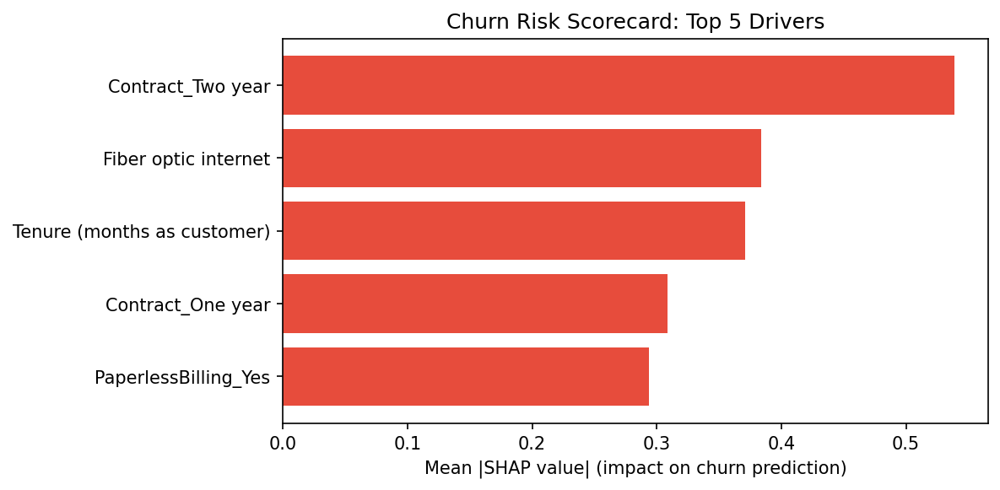

# Predict Customer Churn

Predicting telecom customer churn using machine learning to help retention teams intervene before customers leave.

## Problem
Telecom companies lose significant revenue to churn. This project identifies at-risk customers from behavioral and account data so retention teams can act proactively.

## Data
IBM Telco Customer Churn dataset: 7,043 customers, 21 features including contract type, tenure, monthly charges, and service subscriptions. ~26% churn rate (class imbalance handled with SMOTENC).

## Approach
1. **EDA**: Identified key churn drivers — contract type, tenure, and monthly charges.
2. **Feature Engineering**: Created `AvgMonthlyCharge` and `HasPremiumSupport` features; one-hot encoded categoricals.
3. **Modeling**: Trained Logistic Regression, Random Forest, and Gradient Boosting with 5-fold stratified CV.

## Results

| Model | ROC-AUC | Precision | Recall | F1 |
|---|---|---|---|---|
| Logistic Regression | 0.829 | 0.53 | 0.70 | 0.60 |
| Random Forest | 0.822 | 0.55 | 0.59 | 0.57 |
| Gradient Boosting | 0.833 | 0.53 | 0.68 | 0.60 |

*Note: F1 corrected from 0.59 to 0.60 — a transcription error against notebook03_modeling.ipynb's own recorded output, confirmed by Adaeze. The automated metrics gate in src/train.py verifies the rebuild against this notebook directly.*

**Best model**: Gradient Boosting — highest ROC-AUC and best precision/recall balance for the retention use case.


## Interpretability

Using SHAP values on the Gradient Boosting model, the top 5 drivers of churn are:

1. **Month-to-month contract** — customers without long-term contracts churn at much higher rates
2. **Tenure** — newer customers are significantly more likely to leave
3. **High monthly charges** — customers paying more are at greater risk
4. **No premium support** — customers without OnlineSecurity or TechSupport churn more
5. **Fiber optic internet** — fiber customers show elevated churn vs. DSL




## Project Structure
```
data/         # Raw and processed datasets
notebooks/    # 01_eda, 02_feature_engineering, 03_modeling (exploration only),04_shap_explainabillity
src/          # preprocessing.py, evaluation.py, train.py, model_identity.py
models/       # Saved models, one folder per identity (gitignored)
```

## Reproduce
```bash
pip install -r requirements.txt
python -m src.train
```

This runs the full pipeline end to end: loads the raw data, preprocesses it,
trains the Gradient Boosting model, evaluates it against the held-out test set,
and saves the result under `models/<model_id>/` with its metadata (`model.pkl` + `metadata.json`).

## Model Identity
Each trained model gets a unique identity derived from a hash of the raw data,
the training/preprocessing source code, the training configuration, and the
installed versions of the libraries used to train it (scikit-learn,
imbalanced-learn, pandas, numpy). Rebuilding with unchanged inputs reproduces
the same model ID; changing any of these produces a different one.

```python
from src.model_identity import load_model

# After running `python -m src.train`, use the model ID printed to stdout
# (also the folder name under models/):
model, metadata = load_model("<your_model_id>")
```

